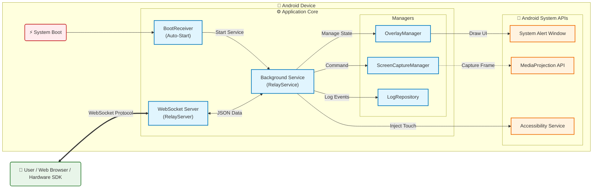

# Android Screen Relay (WebSocket Control & Stream)

โปรเจคระบบส่งภาพหน้าจอและควบคุมเครื่อง Android ระยะไกลผ่าน WebSocket โดยเน้นการทำงานแบบ Background Service และ Overlay Process รองรับการเชื่อมต่อกับ Web Browser เพื่อรับ-ส่งข้อมูล JSON และคำสั่งควบคุมต่างๆ เหมาะสำหรับการนำไปประยุกต์ใช้กับตู้ Kiosk, ระบบ IoT Controller หรือการทำ Remote Support

## 🌟 ฟีเจอร์หลัก (Features)

*   **WebSocket Communication:**
    *   **Server Mode:** เปิด WebSocket Server ภายในแอพเพื่อให้ Client (เช่น Web Browser) เชื่อมต่อเข้ามาได้โดยตรง
    *   **Data Exchange:** รองรับการส่งข้อมูล JSON ไปมาระหว่าง App และ Web แบบ Real-time
    *   **Remote Control:** รับคำสั่งจาก Web (เช่น Click, Swipe) และสั่งงานมือถือผ่าน Accessibility Service
*   **Background Operation:**
    *   ทำงานต่อเนื่องแม้ปิดหน้าจอแอพ หรือล็อคหน้าจอ (Foreground Service)
    *   **Auto-Start:** เริ่มทำงานอัตโนมัติเมื่อเปิดเครื่อง (Boot Receiver)
*   **Screen Capture (MediaProjection):**
    *   รองรับการเข้าถึง MediaProjection API เพื่อจับภาพหน้าจอ (เตรียมพร้อมสำหรับฟีเจอร์ Streaming)
*   **Overlay / Floating Window:**
    *   แสดงสถานะการทำงานและปุ่มควบคุมลอยอยู่บนหน้าจออื่นได้ (System Alert Window)
*   **Log System:**
    *   ระบบบันทึก Log ภายในแอพเพื่อตรวจสอบการทำงานและข้อผิดพลาด (LogRepository)

## 🛠️ วิธีการติดตั้งและใช้งาน (Usage)

1.  **ติดตั้งแอพพลิเคชัน (Install):**
    *   ติดตั้งไฟล์ APK ลงในเครื่อง Android (รองรับ Android 7.0+)
2.  **ตั้งค่าสิทธิ์ (Permissions Setup):** ⚠️ *สำคัญมาก* ต้องเปิดสิทธิ์เหล่านี้เพื่อให้แอพทำงานสมบูรณ์:
    *   **Display over other apps (Floating Window):** อนุญาตให้แอพแสดงทับแอพอื่นได้ (สำหรับ Overlay)
    *   **Accessibility Service:** เข้าไปที่ Settings > Accessibility > Android Screen Relay > เปิดใช้งาน (เพื่อให้แอพสั่ง Click/Swipe ได้)
    *   **Screen Recording / Casting:** กด "Start Now" เมื่อแอพขอสิทธิ์บันทึกหน้าจอ
    *   **Battery Optimization:** เข้าไปที่ App Info > Battery > เลือก Unrestricted (เพื่อให้รัน Background ได้ยาวนาน)
3.  **เริ่มใช้งาน:**
    *   เปิดแอพ กดปุ่ม **"Start Service"**
    *   นำ **IP Address** และ **Port** ที่แสดงในแอพ (เช่น `ws://192.168.1.45:8080`) ไปใส่ใน Web Client
    *   ทดสอบส่งข้อความ JSON จาก Web เข้ามายัง App

## 🧪 วิธีการทดสอบ (Testing)

**การทดสอบระบบ WebSocket (เบื้องต้น):**
1.  **Network Setup:** เชื่อมต่อมือถือและคอมพิวเตอร์ให้อยู่ในวง LAN เดียวกัน (Wi-Fi เดียวกัน)
2.  **Start Server:** เปิดแอพและ Start Service สังเกต IP Port ที่แสดง
3.  **WebSocket Client:** ใช้เครื่องมือทดสอบ เช่น Postman, PieSocket หรือเขียน HTML ง่ายๆ
4.  **Connect:** เชื่อมต่อมายัง URL ของมือถือ `ws://<DEVICE_IP>:<PORT>`
5.  **Test Send (App -> Web):**
    *   ดู Log บน Web Client ว่าได้รับข้อความ "Connected" หรือข้อมูล JSON หรือไม่
6.  **Test Receive (Web -> App):**
    *   ลองส่ง JSON command จาก Web ไปยัง App:
        ```json
        {
            "type": "alert",
            "message": "Hello Android from Web!"
        }
        ```
    *   ตรวจสอบที่มือถือว่ามี **Notification** หรือ **Toast** แจ้งเตือนขึ้นหรือไม่ (แม้ขณะยุบแอพ)

## 🏗️ System Diagram (Detailed)



## 📝 Engineering Notes

### วัตถุประสงค์ (Objectives)
*   เพื่อสร้างระบบ Remote Control และ Screen Mirroring ที่ทำงานได้เสถียรใน Background (Reliability)
*   เพื่อเตรียมพร้อมสำหรับการเชื่อมต่อกับอุปกรณ์ Hardware ภายนอก (เช่น SDK ของ Dipchip) ในอนาคต
*   เพื่อลดความซับซ้อนของการเชื่อมต่อ โดยใช้ WebSocket เป็นมาตรฐานกลางในการสื่อสาร (Standardization)

### ประโยชน์จากโปรเจค (Benefits)
*   สามารถควบคุมอุปกรณ์ Android ระยะไกลได้โดยไม่ต้อง Root (ใช้ Accessibility Service)
*   นำไปประยุกต์ใช้กับตู้ Kiosk หรือป้ายโฆษณาที่ต้องการการบำรุงรักษาระยะไกลได้
*   เป็นพื้นฐานในการพัฒนาต่อยอดไปสู่ระบบ IoT Control ที่ซับซ้อนขึ้น

### Technical Overview
*   **Architecture:** MVVM Pattern โดยมี Service เป็นแกนหลักในการประมวลผล (Service-based Architecture)
*   **Networking:** ใช้ `org.java_websocket` สำหรับ Server side บนมือถือ และ `OkHttp` สำหรับ Client mode
*   **Security:** มีระบบ Auth Key เบื้องต้นในการเชื่อมต่อ (ระบุใน `RelayServer.kt`)
*   **Reliability:** ใช้ Foreground Service พร้อม Notification channel เพื่อป้องกัน Android System Kill Process

## ✅ รายการ Task ที่ทำไปแล้ว (Completed Tasks)

อ้างอิงจากแผนงานและสิ่งที่ implement แล้วในโค้ด:

- [x] **Project Setup:** สร้างโปรเจค Android รองรับ Kotlin/Compose
- [x] **Network Core:**
    - [x] สร้าง `WebSocketManager.kt` สำหรับจัดการการเชื่อมต่อ Client
    - [x] สร้าง `RelayServer.kt` สำหรับทำหน้าที่เป็น WebSocket Server
- [x] **Background System:**
    - [x] Implement `RelayService` (Foreground Service)
    - [x] Implement `BootReceiver` สำหรับ Auto-start เมื่อเปิดเครื่อง
- [x] **Permissions Handling:**
    - [x] จัดการขอสิทธิ์ Overlay (Floating Window)
    - [x] จัดการขอสิทธิ์ Accessibility Service
    - [x] จัดการขอสิทธิ์ Internet และ Foreground Service
- [x] **Accessibility Integration:**
    - [x] สร้าง `RelayAccessibilityService` สำหรับรองรับการควบคุมระยะไกล (Click/Swipe)
- [x] **Overlay UI:**
    - [x] สร้าง `OverlayManager` สำหรับแสดงผลทับหน้าจออื่น
- [x] **Log System:**
    - [x] สร้างระบบ Log พื้นฐาน (`LogRepository`) เพื่อใช้ Audit การทำงาน

---
### 🔗 References
*   [Android Accessibility Service Documentation](https://developer.android.com/reference/android/accessibilityservice/AccessibilityService)
*   [MediaProjection API](https://developer.android.com/guide/topics/large-screens/media-projection)
*   [Java-WebSocket Library](https://github.com/TooTallNate/Java-WebSocket)
*   Reference App: Let's View (Background/Overlay behavior)

