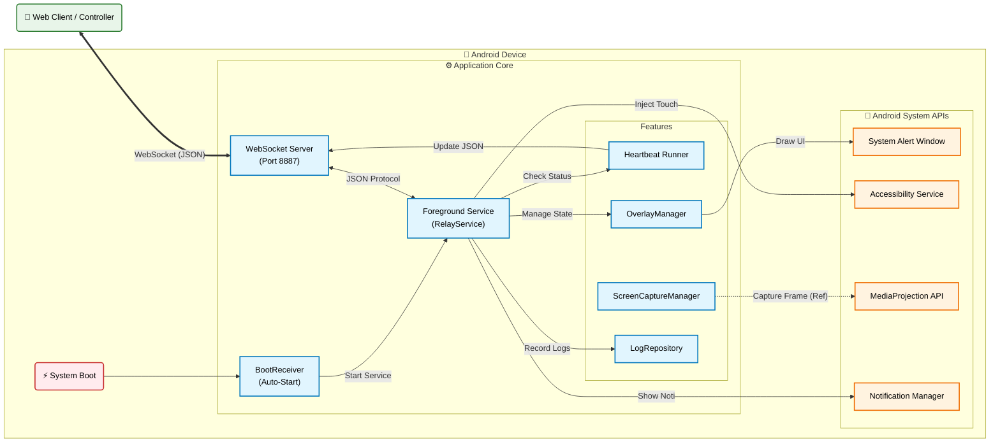

# Android Screen Relay (WebSocket Control & Stream)

โปรเจคระบบส่งภาพหน้าจอและควบคุมเครื่อง Android ระยะไกลผ่าน WebSocket โดยเน้นการทำงานแบบ Background Service และ Overlay Process รองรับการเชื่อมต่อกับ Web Browser เพื่อรับ-ส่งข้อมูล JSON และคำสั่งควบคุมต่างๆ เหมาะสำหรับการนำไปประยุกต์ใช้กับตู้ Kiosk, ระบบ IoT Controller หรือการทำ Remote Support

## 🌟 ฟีเจอร์หลัก (Features)

*   **WebSocket Communication (JSON-First):**
    *   **Server Mode:** เปิด WebSocket Server ภายในแอพ (Port 8887) เพื่อให้ Client เชื่อมต่อเข้ามาได้โดยตรง
    *   **JSON Protocol:** ใช้ JSON เป็นสื่อกลางในการคุยกันระหว่าง App และ Web ทำให้เบาและตรวจสอบง่าย
    *   **Real-time Control:** รองรับคำสั่งจาก Web (Ping, Notification, Auth) และส่งผลลัพธ์กลับทันทีแบบ Two-way communication
*   **Web Client Interface:**
    *   มีหน้าเว็บสำเร็จรูป (`web_client/index.html`) สำหรับทดสอบเชื่อมต่อและส่งคำสั่ง
    *   **Auto-Reconnect:** ระบบพยายามเชื่อมต่อใหม่อัตโนมัติเมื่อหลุด
    *   **Log Viewer:** ดู Log การตอบโต้จากมือถือได้ทันทีบนหน้าเว็บ
*   **Background Operation:**
    *   **Heartbeat System:** ส่งสัญญาณชีพ (Status) บอก Web Client ตลอดเวลาว่า App ยังทำงานอยู่ (แม้จะยุบจอ)
    *   **Foreground Service:** ทำงานต่อเนื่องยาวนานโดยไม่ถูก Android System Kill
    *   **Auto-Start:** เริ่มทำงานอัตโนมัติเมื่อเปิดเครื่อง (Boot Receiver)
*   **Log System & Export:**
    *   **Structured Logs:** บันทึก Log แบบละเอียด (Timestamp, Component, Event, Data)
    *   **JSON Export:** สามารถ Export Log ออกมาเป็นไฟล์ JSON เพื่อนำไปวิเคราะห์ต่อได้ (Local Time ตรงกับไทย)
*   **Security:**
    *   **Passkey Auth:** ระบบยืนยันตัวตนก่อนอนุญาตให้รับคำสั่ง (ต้องใส่ Key ให้ตรงกับที่แสดงบนจอ)
*   **Log System:**
    *   ระบบบันทึก Log ภายในแอพเพื่อตรวจสอบการทำงานและข้อผิดพลาด (LogRepository)

## 🛠️ วิธีการติดตั้งและใช้งาน (Usage)

### ฝั่ง Android App
1.  **ติดตั้งแอพพลิเคชัน (Install):**
    *   Deploy Project ลงเครื่อง Android (รองรับ Android 7.0+)
2.  **ตั้งค่าสิทธิ์ (Permissions Setup):** ⚠️ *สำคัญมาก* ต้องเปิดสิทธิ์เหล่านี้:
    *   **Display over other apps:** อนุญาตให้แอพแสดงทับแอพอื่นได้ (สำหรับ Overlay)
    *   **Accessibility Service:** เปิดใช้งาน "Android Screen Relay" ใน Settings > Accessibility
    *   **Notification:** อนุญาตให้แจ้งเตือน (สำหรับการทดสอบคำสั่ง Notification)
3.  **เริ่มใช้งาน:**
    *   เปิดแอพ กดปุ่ม **"Start Service"**
    *   จด **IP Address** และ **Passkey** ที่แสดงบนหน้าจอ (เช่น `ws://192.168.1.X:8887`)

### ฝั่ง Web Client (Controller)
1.  **เปิดไฟล์ Web:**
    *   เปิดไฟล์ `web_client/index.html` ใน Browser (Chrome, Edge, Safari) บนคอมพิวเตอร์หรือมือถือเครื่องอื่น (ต้องอยู่วง LAN เดียวกัน)
2.  **เชื่อมต่อ (Connect):**
    *   ใส่ URL: `ws://<ANDROID_IP>:8887`
    *   ใส่ Passkey: ตามที่แสดงบนหน้าจอแอพ
    *   กด **Connect**
3.  **ทดสอบส่งคำสั่ง:**
    *   **Ping:** กดปุ่ม Ping เพื่อดูค่า Latency
    *   **Notification:** กดปุ่ม Test Notification เพื่อสั่งให้มือถือเด้งแจ้งเตือน (ทดสอบ Background Control)

## 🧪 วิธีการทดสอบ (Testing)

**การทดสอบระบบ Control & Command (JSON):**
1.  **Start Server:** เปิดแอพ Android และ Start Service
2.  **Connect Web Client:** เปิดหน้าเว็บและเชื่อมต่อ
3.  **Check Heartbeat:** สังเกต Log บนหน้าเว็บ จะเห็นข้อความ `💓 Heartbeat Status Changed` ยืนยันว่ามือถือส่งสถานะมา
4.  **Test Background:**
    *   กดปุ่ม Home บนมือถือ (App จะลงไปอยู่ Background)
    *   สังเกต Log Heartbeat บนเว็บต้องมีค่า `"is_background": true`
5.  **Test Command:**
    *   กดปุ่ม **Test Notification** บนหน้าเว็บ
    *   ตรวจสอบที่มือถือว่ามี **Notification เด้งขึ้นมาจริง** (ยืนยัน Two-way communication สมบูรณ์ 100%)

## 🏗️ System Diagram (Detailed)

## 📝 Engineering Notes

### วัตถุประสงค์ (Latest Updates)
*   **Stability First:** เปลี่ยนมาโฟกัสที่ความเสถียรของการเชื่อมต่อและการสั่งงานผ่าน Text/JSON ก่อนเริ่มทำ Video Stream
*   **Two-Way Communication:** ยืนยันว่าสามารถ "สั่งงาน" จากระยะไกลได้จริง และ "รับทราบ" ผลลัพธ์ได้ (ผ่าน Notification/Logs)
*   **Debuggability:** ปรับปรุงระบบ Log ให้ละเอียดและ Export ได้ง่าย เพื่อลดเวลาในการหาข้อผิดพลาด (Time-to-Resolution)

### Technical Overview
*   **Architecture:** MVVM Pattern โดยมี Service เป็นแกนหลักในการประมวลผล (Service-based Architecture)
*   **Networking:** ใช้ `org.java_websocket` สำหรับ Server side บนมือถือ (Port 8887) และ `WebSocket API` บน Browser Client
*   **Security:** มีระบบ Passkey Auth ป้องกันการเชื่อมต่อที่ไม่ได้รับอนุญาต
*   **Reliability:** ใช้ Foreground Service + Heartbeat Mechanism เพื่อรักษา Connection ให้คงอยู่ตลอดเวลา

## ✅ รายการ Task ที่ทำไปแล้ว (Completed Tasks)

อ้างอิงจากแผนงานและสิ่งที่ implement แล้วล่าสุด:

- [x] **Project Setup:** สร้างโปรเจค Android รองรับ MVVM/Compose
- [x] **Network Core:**
    - [x] Implement `RelayServer` (WebSocket) ที่ Port 8887
    - [x] ออกแบบ **JSON Protocol** สำหรับคุยกับ Client
- [x] **Web Client:**
    - [x] สร้าง `index.html` เป็น Controller board อย่างง่าย
    - [x] ระบบ Retry Connection, Authentication และ Log Viewer
- [x] **Control System:**
    - [x] **Heartbeat:** ส่งสถานะแอปให้ Client รับรู้ตลอดเวลา
    - [x] **Remote Notification:** สั่งให้มือถือแสดง Notification จากระยะไกลสำเร็จ
    - [x] **Background Runner:** แอปทำงานได้แม้ปิดหน้าจอ
- [x] **Log System:**
    - [x] **JSON Export:** บันทึก Log ลงไฟล์เพื่อตรวจสอบย้อนหลังได้ (Local Time)
    - [x] **Reliable Logging:** ปรับปรุงการเก็บ Log ไม่ให้ข้อมูลหาย
    - [x] สร้างระบบ Log พื้นฐาน (`LogRepository`) เพื่อใช้ Audit การทำงาน

---
### 🔗 References
*   [Java-WebSocket Library](https://github.com/TooTallNate/Java-WebSocket)
*   [Android Foreground Services](https://developer.android.com/guide/components/foreground-services)
*   [Android Accessibility Service Documentation](https://developer.android.com/reference/android/accessibilityservice/AccessibilityService)
*   [MediaProjection API](https://developer.android.com/guide/topics/large-screens/media-projection)
*   Reference App: Let's View (Background/Overlay behavior)

