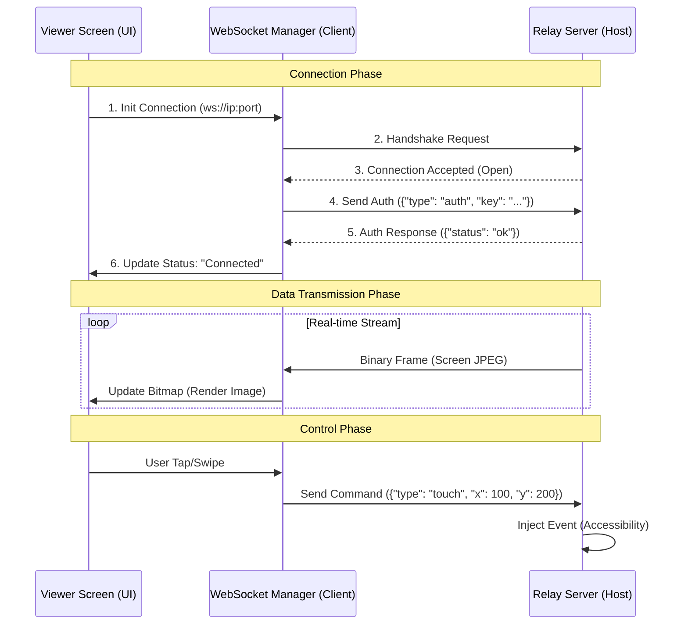

# Android Screen Relay
### System-level Android Relay Service for Background Control & Device Integration
*(Designed for industrial / system use cases - hardware integration ready)*

---

Android Screen Relay คือรากฐานระบบ **System-level Android Application** ที่ถูกออกแบบมาเพื่อการทำงานเบื้องหลัง (Background Execution) อย่างเสถียร โดยทำหน้าที่เป็น "ตัวกลาง" (Relay) ในการเชื่อมต่อ สั่งการ และตรวจสอบสถานะของอุปกรณ์ Android ผ่านระบบเครือข่าย

โปรเจกต์นี้**ไม่ใช่แค่แอป Screen Mirroring ทั่วไป** แต่เป็นโครงสร้างพื้นฐาน (Infrastructure) สำหรับงานระบบที่ต้องการ reliability สูง เช่น ตู้ Kiosk, IoT Controllers, หรือ Industrial Displays

## 🎯 System-Level Design Goals (เป้าหมายการออกแบบ)

โปรเจกต์นี้ถูกออกแบบโดยเน้นหลักการสำคัญ:

1.  **Persistent Background Execution**: ระบบต้องทำงานได้ตลอดเวลา (24/7) ผ่าน Foreground Service แม้จะปิดหน้าจอหรือสลับแอป
2.  **Auto-Restart & Recovery**: กลยุทธ์การกู้คืนระบบอัตโนมัติเมื่อ Service ถูก Kill (ใช้ `START_STICKY` + Recovery-ready design) เพื่อให้ระบบกลับมาทำงานเองได้ (Unattended Use)
3.  **System Communication Bus**: ใช้ WebSocket เป็นท่อส่งข้อมูลหลักสำหรับการควบคุมไม่ใช่แค่ Streaming
4.  **Non-Intrusive Status**: การแจ้งเตือนสถานะต้องไม่รบกวนหน้าจอหลัก (Overlay/Notification)
5.  **Hardware Integration Ready**: โครงสร้าง Code เตรียมพร้อมสำหรับเชื่อมต่อกับ module ภายนอก

---

## 🏗 System Capabilities

### 1️⃣ Core System Capabilities (MVP Focus)
*   **Foreground Service Persistence**: Service ที่ "ตายยาก" (Sticky Service) และกู้คืนตัวเองได้
*   **Structured System Logging**: ระบบ Log แบบ JSON Parsing ที่ละเอียดระดับ Component พร้อม Export
*   **Overlay Status**: การแสดงสถานะ "On Air" แบบลอยเหนือแอปอื่น
*   **Battery Optimization Handling**: ระบบจัดการ Permission เพื่อขอสิทธิ์ทำงานเบื้องหลัง

### 2️⃣ Extended Capabilities (Optional)
*   **Screen Streaming**: การส่งภาพหน้าจอแบบ Real-time (Binary Stream)
*   **Remote Touch Control**: การสั่งงานผ่าน Accessibility Service
*   **Network Discovery**: ระบบค้นหาอุปกรณ์อัตโนมัติผ่าน UDP

---

## 🔌 WebSocket System Channel (MVP)

WebSocket is designed as a **system communication bus**, used for:
- Service heartbeat & keep-alive signals
- App / system state reporting (Telemetry)
- Command → execution → result flow
- Background-safe communication even when UI is not active

ระบบใช้ WebSocket เพื่อการสื่อสารระดับ **System Bus** โดยมี Format ข้อมูลแบบ JSON Standard.

### 1. Log / Event Structure
```json
{
  "timestamp": "2024-02-12T20:30:00Z",
  "level": "INFO", 
  "component": "RelayService",
  "event": "heartbeat",
  "data": { "uptime_sec": 1204, "is_background": true }
}
```

### 2. Supported Message Types
*   **Heartbeat**: ยืนยันสถานะ Service (`uptime`, `memory`, `service_state`)
*   **Command**: คำสั่งจากภายนอก (`click`, `swipe`, `stop_service`)
*   **Telemetry**: รายงานสถานะเครือข่าย

---

## 📐 System Architecture Diagram

```
[Client / Control Panel]
           |
 (WebSocket System Bus)
           |
           v
+--------------------------+
|  Android Relay Service   |
+--------------------------+
|                          |
|  [ WebSocket Manager ] <-----> (Cmd / Heartbeat / Logs)
|           |              |
|           +--------------+----> [ Core Logic ] (Auto-Restart)
|           |              |           |
|  [ Screen Capture ]      |      [ Log Repository ]
|           |              |           |
|  [ Accessibility ]       |      [ Export Module ] (JSON)
|                          |
+--------------------------+
           |
    (Hardware / SDK)
     [ Dipchip Adapter ] ... (Future Integration)
```

## 🔌 WebSocket Communication Flow

แผนภาพการทำงานเมื่อ Viewer เชื่อมต่อกับ Host:



---

## 📱 Features & How to Use (การใช้งาน)

### 1. Permission Setup
1.  **Allow Background Running**: ปิด Battery Optimization (สำคัญสำหรับ `Auto-restart`)
2.  **Floating Windows**: แสดงสถานะ Overlay
3.  **Notification**: แสดงสถานะ Notification Bar (Android 13+)
4.  **Accessibility**: ควบคุมหน้าจอระยะไกล

### 2. System Log View
*   เข้าเมนู **System View** เพื่อดู Log การทำงานแบบ Real-time (JSON Components)
*   **Export Data**: ส่งออกเป็นไฟล์ `.json`

---

## 🔧 Engineering Notes / Log

### 1. ความเสถียรของ Service (`START_STICKY`)
- **Optimization**: ปรับใช้ `START_STICKY` ใน Service และแยก Threading ออกจาก Main UI
- **Result**: Improves long-running reliability for on-call / unattended use cases. (แอปทำงานได้ยาวนาน ลดภาระการดูแลหน้างาน)

### 2. ประสิทธิภาพการส่งข้อมูล (Binary Stream)
- **Optimization**: เปลี่ยนการส่งข้อมูลภาพเป็น Raw Binary Streams แทน Base64
- **Result**: Reduces bandwidth usage and CPU load, enabling scalable deployment on low-end hardware. (ประหยัดทรัพยากรเครื่อง)

### 3. Structured Logging & Export
- **Impl**: ระบบ Log แบบ JSON objects แทน Plain text
- **Result**: Enables automated system diagnostics and easier fault isolation. (ช่วยให้การตรวจสอบปัญหาง่ายขึ้นมาก)

---
*Project Status: System-Level MVP Complete (Ready for integration)*

